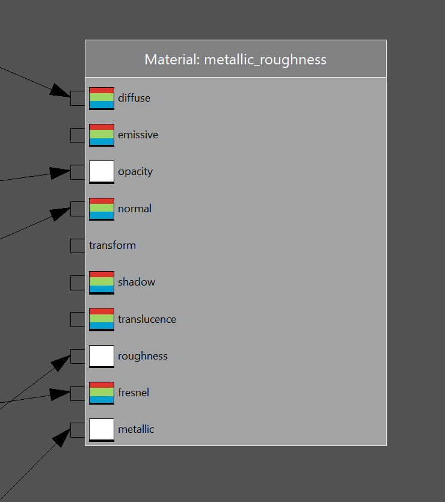

## Catalog
*  [Overview](#overview)
*  [Return](./menu.md)

# Overview
This is a not-yet-available tool named material.ed.exe.
My knowledge of it is very limited, and here is the only screenshot of it in normal operation:  

In short, it is roughly similar to unity or unreal engine's visual shader editor.  

Because it is currently unavailable, nothing further will be covered in this section.